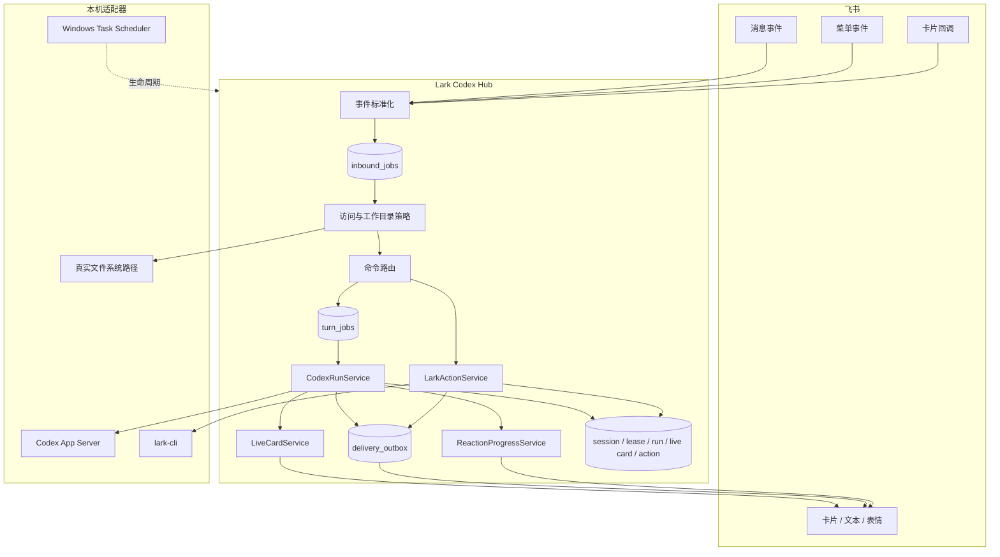
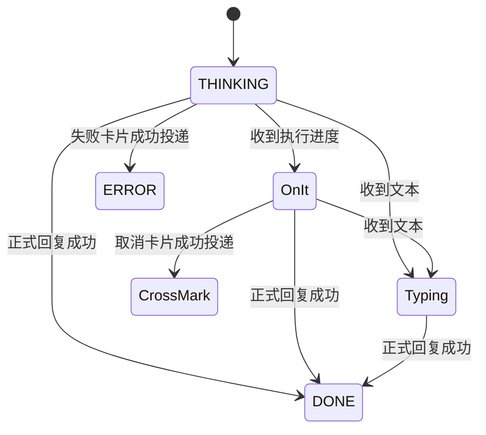

# 架构说明

Lark Codex Hub 使用端口与适配器架构。应用层只依赖抽象端口，飞书 SDK、Codex CLI、SQLite、文件系统、Windows 任务计划程序和 `lark-cli` 均位于外围适配器。

## 总体数据流



## 目录结构与职责

```text
src/
├─ contracts/      事件、配置、任务和展示契约
├─ domain/         访问策略、范围、分片和错误语义
├─ ports/          Codex、飞书、状态、动作和工作目录端口
├─ application/    命令、运行、投递、恢复和动作编排
├─ adapters/       SDK、CLI、SQLite、文件系统和 Windows 实现
├─ composition/    运行时装配与生命周期
└─ cli/            setup、doctor、status、notify 和 service 命令
```

`HubController` 只负责把通过访问策略的消息分发给命令、Codex 或飞书动作服务。业务细节分别位于独立服务中，避免把会话、工作目录、确认和投递逻辑重复写在控制器里。

命令名称、别名、说明、菜单事件和卡片动作统一注册在 `command-registry`。`ControlCenterService` 根据当前会话和队列状态生成动态入口，避免帮助文本、菜单和回调路由各维护一套命令字符串。

## 持久化入站处理

飞书 WebSocket 回调不会直接执行长任务，而是先把标准化事件写入 `inbound_jobs`：

1. `event_id` 和 `message_id` 通过数据库唯一约束去重。
2. Worker 使用事务原子领取任务，并写入 holder 和过期时间。
3. 处理中定时续约，完成或失败后写入终态。
4. 单个 Worker 按数据库领取顺序处理消息、菜单和卡片动作，避免 `/new`、`/cancel` 与普通消息发生控制顺序竞争。

不自动重跑普通消息是刻意的保守策略：进程可能在本地完成了部分文件修改，但尚未来得及记录成功。如果自动执行第二次，可能造成重复修改。

## Codex App Server 与会话并发

飞书范围由 `chat_id + operator_open_id` 组成，拥有当前 Codex 绑定、工作目录偏好和 session 历史。全局会话目录以 Codex `thread/list` 为事实来源，显式查询 `cli`、`vscode`、`exec` 和 `appServer`，再通过真实路径解析过滤到 `allowedRoots`。Hub SQLite 只保存绑定和曾使用历史，不再承担全局会话发现。

运行时按需启动一个 `codex app-server --listen stdio://`。Hub 通过省略 `jsonrpc` 字段的 JSONL RPC 与它通信。全局并发由 `runtime.maxConcurrentTurns` 限制，个人工作站默认值为 1：

```text
initialize -> initialized
thread/start | thread/resume | thread/read | thread/list
turn/start | turn/steer | turn/interrupt
```

`CodexExecAgent` 仍作为显式兼容后端保留，只有配置 `codex.backend = "exec"` 时才会按消息启动 `codex exec` 子进程。

普通文本先写入 `turn_jobs`，而不是占用入站事件 Worker：

```text
pending -> running -> completed | failed | cancelled | interrupted
```

同一会话使用 FIFO 顺序执行。800 毫秒内的连续消息合并为一个 Turn；任务运行时，`/steer` 或回复当前任务消息会调用 `turn/steer`。`/cancel` 调用 `turn/interrupt` 并清除尚未运行的当前范围消息。

有 session 绑定时，队列 lane 和租约资源键都是 `session:<id>`；没有绑定时是 `scope:<key>`。这样即使两个飞书范围指向同一 session，也只有一个任务能进入 Codex。另一个独立客户端造成的 `already has an active writer` 会转换为可理解的交接提示。

`thread/read` 和 `thread/list` 不会加载会话，因此 `/sessions` 与 `/resume` 的绑定步骤不占用 writer。Codex App Server 即使取消订阅也会把已加载线程保留一段时间；为让 Desktop 或 VS Code 在飞书 Turn 完成后立即接管，最后一个活动 Turn 结束、失败或取消后，Hub 会回收 App Server 子进程。Hub 主服务、飞书连接和持久队列不会停止，下一次执行会自动重新初始化 App Server。

每个 App Server 子进程具有独立代际编号，旧进程的延迟 `close/error` 不能清理新实例。Turn 使用单次结算标记合并完成、超时、取消、关闭和断连路径；只读 RPC 和执行操作使用引用计数，回收只会发生在所有操作完成之后。

## 流式卡片

App Server 的 agent message delta、item lifecycle 和 Token 事件会被转换成稳定的展示事件。Hub 不展示原始推理内容，只显示“正在分析、运行命令、修改文件、生成回复”等用户可理解状态。

第一条有效进度会创建一张可更新卡片，之后最多约每秒更新一次。Turn 完成后，同一张卡片通过可靠投递队列切换为正式结果；过长回复会把实时卡片收束为完成提示，并用后续分片卡片发送全文。

实时卡片 ID 持久化到 `live_cards`。服务异常退出后，恢复流程会把遗留卡片更新为“已中断”，而已经进入 `delivery_outbox` 的正式结果继续重试。

## 可靠投递

所有回复、主动通知和卡片更新先写入 `delivery_outbox`：

- Worker 原子领取待投递记录。
- 失败使用有上限的指数退避。
- 达到最大次数后进入 `failed`，不会无限重试。
- 同一张卡片的更新具有递增 revision；新版本会把等待重试的旧版本标记为 `superseded`。
- 回复和主动发送的飞书 UUID 由幂等键与分片序号稳定派生。
- 远端已接受、但本地尚未标记完成时发生崩溃，重试仍使用同一 UUID。

长 Markdown 在语义展示层拆成连续编号卡片。只有正式结果成功投递后，临时进度表情才会切换到完成、失败或取消终态。

## 进度表情状态机



临时 reaction_id 存入 SQLite。切换状态时先按准确 ID 删除旧表情，再添加新表情。服务恢复会清理遗留临时状态；终态表情按配置保留。

## 工作目录安全

字符串前缀检查不能阻止符号链接或 Windows Junction 逃逸。因此工作目录适配器会：

1. 解析请求目录和所有允许根目录的真实路径。
2. 确认请求路径存在且是目录。
3. 使用相对路径关系判断真实目录是否位于任一允许根目录内。
4. 拒绝通过链接跳转到白名单外的位置。

目录切换会清除当前 session 绑定，使下一条消息在新目录创建 session，避免把旧 session 的上下文错误用于另一项目。

## 飞书身份与动作确认

机器人身份负责事件接收、卡片回复和主动通知。用户身份只在显式启用 `lark-cli` 后用于受控动作。

动作经过中心 Zod 判别联合校验，不能携带原始可执行文件、子命令、参数数组或 shell 片段。需要确认时：

1. 生成 96 位随机确认 ID。
2. 持久化动作和发起人的 operator、chat、scope。
3. 卡片展示动作、风险和参数。
4. 确认使用原子 `pending -> executing` 状态切换。
5. 重复按钮或并发 `/confirm` 最多只有一个成功领取。
6. 中断的高风险动作不会自动重试。

## 密钥与日志

- App ID/App Secret 在 setup 时通过 stdin 或临时环境变量进入进程。
- 持久密钥库使用当前 Windows 用户的 DPAPI。
- 普通配置不包含 App Secret。
- 结构化日志递归脱敏 secret、token、authorization、password 和 App ID 字段。
- 日志按大小轮转，并限制保留数量。

## Windows 生命周期

任务计划程序执行隐藏的 VBS，VBS 启动隐藏、非交互式 PowerShell，再启动 Node 运行时。Node 退出码逐层传回计划任务，使 Windows 能识别故障并按策略重启。

`service stop` 使用本地停止请求触发应用级优雅关闭；它不同于直接终止计划任务，后者可能来不及清理 Codex、队列和 SQLite。

## 扩展原则

- 新飞书动作先加入中心动作 Schema，再由 `ActionBroker` 映射。
- 不增加原始 CLI 或 shell 透传。
- 新外部系统实现端口适配器，不把 SDK 类型泄漏到应用层。
- 新状态必须具有明确的恢复语义和幂等边界。
- 安全默认值应失败关闭，扩权必须显式配置。
