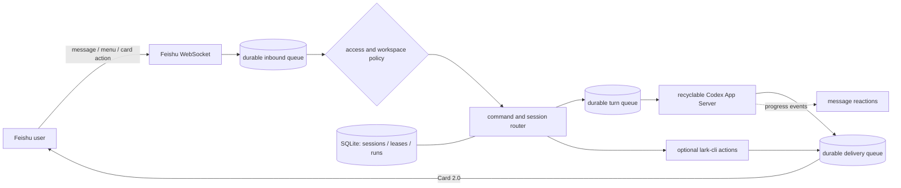

# Lark Codex Hub

[中文](README.md) · [Feishu setup](docs/FEISHU_SETUP.md) · [Operations](docs/OPERATIONS.md) · [Architecture](ARCHITECTURE.md)


[](LICENSE)

Turn your private Feishu/Lark bot into a secure, durable, and recoverable remote control plane for Codex App Server running on your own Windows computer.

You can send coding tasks from Feishu, resume persistent Codex sessions, switch discovered projects, receive completion cards, and optionally invoke a small allowlist of `lark-cli` actions. Source code and credentials remain on your workstation; no public server or third-party relay is required.

> [!IMPORTANT]
> This is a self-hosted tool for a personal Windows workstation, not a multi-user hosted Codex service. The bot runs Codex locally and can modify files in the selected project. Review the [security boundaries](#security-boundaries) before installation.

## Highlights

- Create, resume, inspect, switch, and cancel Codex sessions from Feishu.
- Discover and bind persistent Codex threads created by Desktop, VS Code, CLI, or Hub.
- Keep the official Desktop and VS Code launch paths untouched; clients hand off the same persisted thread sequentially.
- Persist user turns in a FIFO queue, coalesce rapid messages, and stream output into one live card.
- Persist inbound events, deliveries, sessions, leases, approvals, and recovery state in SQLite WAL.
- Render Card 2.0 replies with Markdown continuation cards, timing, workspace, session, and token usage.
- Show thinking, working, typing, completion, failure, and cancellation reactions on the original message.
- Prevent concurrent writes to the same Codex session across Feishu scopes.
- Restrict users, chats, sandbox modes, and unsafe filesystem roots by default.
- Send proactive notifications from local scripts through a durable retry queue.
- Optionally create Lark tasks/documents or send messages through validated `lark-cli` actions.
- Start silently at Windows logon and stop gracefully for upgrades.
- Use a context-aware control center card instead of memorizing every slash command.

## Data flow



## Requirements

- Windows 10 or 11.
- Node.js 22.12 or newer.
- [Codex CLI](https://learn.chatgpt.com/docs/codex/cli) installed and authenticated.
- Git.
- A Feishu/Lark custom app with bot capability and WebSocket events.
- Optional: `lark-cli` for user-identity actions.

Linux, macOS, Docker, and multi-user server deployments are not currently validated.

## Quick start

### 1. Prepare the Feishu app

Create a custom app in the [Feishu Open Platform](https://open.feishu.cn/app), enable its bot capability, grant message permissions, and use long connection mode for `im.message.receive_v1`.

Optional features require:

- `application.bot.menu_v6` for bot shortcuts.
- `card.action.trigger` for confirmation buttons.
- `im:message.reactions:write_only` for progress reactions.

Publish a new app version after every permission, event, or menu change. See the [Feishu setup guide](docs/FEISHU_SETUP.md) for the complete checklist.

### 2. Install

```powershell
git clone https://github.com/AIME-JF/lark-codex-hub.git
Set-Location .\lark-codex-hub
npm ci
npm run check
```

### 3. Save local configuration

Use temporary environment variables so credentials never appear in command-line arguments or repository files:

```powershell
$env:LARK_APP_ID = "cli_xxx"
$env:LARK_APP_SECRET = "your App Secret"

node .\dist\cli\index.js setup --from-env `
  --owner "ou_xxx"

Remove-Item Env:LARK_APP_ID, Env:LARK_APP_SECRET
```

Credentials are encrypted with current-user Windows DPAPI. If `lark-cli` is not installed, set `larkCli.enabled` to `false` in `%USERPROFILE%\.lark-codex-hub\config.v5.json`.

The recyclable App Server backend is the default. Hub keeps it only while needed and closes the child process after the final active Feishu turn to release cross-client writer ownership. Set `codex.backend` to `exec` only as an explicit compatibility fallback.

Personal workstations execute one Codex turn at a time by default. Set `runtime.maxConcurrentTurns` between 1 and 8 only when the machine has enough resources.

### 4. Diagnose and start silently

```powershell
node .\dist\cli\index.js doctor
node .\dist\cli\index.js service install
node .\dist\cli\index.js service start
node .\dist\cli\index.js service status
```

Send `/status` to the bot. A status card confirms the full message path is working.

## Bot commands

| Command | Purpose |
| --- | --- |
| `/help`, `/hub` | Open the context-aware Codex control center |
| `/new` | Explicitly choose to create a session in the current project |
| `/status` | Show workspace, session, and runtime state |
| `/projects [page or query]` | Browse Codex projects grouped by working directory |
| `/sessions [page]` | Page through global Codex sessions in the current project |
| `/history [page]` | Page through user and assistant messages in the bound session |
| `/resume <session_id>` | Bind an allowed global session without loading or locking it |
| `/cancel` | Cancel the active task |
| `/queue` | Show messages waiting for execution |
| `/steer <instruction>` | Add an instruction to the active turn |
| `/workspace` | Alias for `/projects` |
| `/tools` | Show optional Feishu/Lark extension commands |
| `/send <bot\|user> <open_id\|chat_id> <ID> <text>` | Send a validated `lark-cli` message |
| `/task <summary>` | Create a Lark task as the authorized user |
| `/doc <title>` | Create a Lark document from the following Markdown body |
| `/confirm <id>`, `/reject <id>` | Resolve a risky Lark action |

All other text is forwarded to the current Codex session. Unknown `/commands` are rejected locally instead of consuming a Codex turn.

## Proactive notifications

Local scripts can enqueue a result card:

```powershell
node .\dist\cli\index.js notify "The build has completed"
```

The running service delivers it to `ownerOpenId` with bounded retries.

## State directory

The default state directory is `%USERPROFILE%\.lark-codex-hub`:

| Path | Purpose |
| --- | --- |
| `config.v5.json` | Non-secret policy and runtime configuration |
| `secrets.v2.json` | Current-user DPAPI-encrypted app credentials |
| `hub.sqlite*` | Sessions, queues, leases, runs, and approvals |
| `logs\hub.log*` | Rotating structured logs with redaction |
| `service-launcher.v2.*` | Hidden-window launchers |

See [Operations](docs/OPERATIONS.md) for upgrades, backups, removal, recovery, and troubleshooting.

## Security boundaries

- Access fails closed to the configured owner, users, and chats.
- Group messages require a bot mention by default.
- Workspaces are checked after resolving symlinks and Windows Junctions.
- Only `read-only` and `workspace-write` Codex sandboxes are exposed.
- Child processes are spawned with argument arrays and no shell.
- Lark extensions accept typed actions rather than raw CLI passthrough.
- Risk confirmations are bound to the initiating operator, chat, and scope and are atomically claimed.
- App credentials are never stored in plaintext configuration or repository files.

Read [Security Policy](SECURITY.md) for the full threat model and reporting guidance.

## Known limitations

- The Codex App Server command and protocol can evolve with Codex CLI releases; run `doctor` after upgrading Codex CLI.
- Desktop, VS Code, CLI, and Hub share persisted Codex history, not a real-time mirrored interface; thread lists may need a refresh.
- A thread can have only one App Server writer at a time. When a local client owns it, Feishu reports the busy state and never silently creates a replacement thread.
- Hub recycles its App Server after the final Feishu turn so another Codex client can resume the thread.
- A forcibly interrupted Codex run is not automatically replayed because it may already have changed files.
- Feishu image and file attachments are not currently passed to Codex.
- Documentation for the Feishu console is Chinese-first because console labels differ by tenant and locale.

## Documentation

- [Feishu Open Platform setup](docs/FEISHU_SETUP.md)
- [Operations and troubleshooting](docs/OPERATIONS.md)
- [Architecture and reliability](ARCHITECTURE.md)
- [Message, session, and action protocol](docs/PROTOCOL.md)
- [Security Policy](SECURITY.md)
- [Contributing](CONTRIBUTING.md)
- [Changelog](CHANGELOG.md)

## Development

```powershell
npm ci
npm run check:release
```

Tests must use synthetic data. Never publish real Feishu IDs, credentials, messages, logs, screenshots, or workstation paths.

## License

[MIT](LICENSE)
