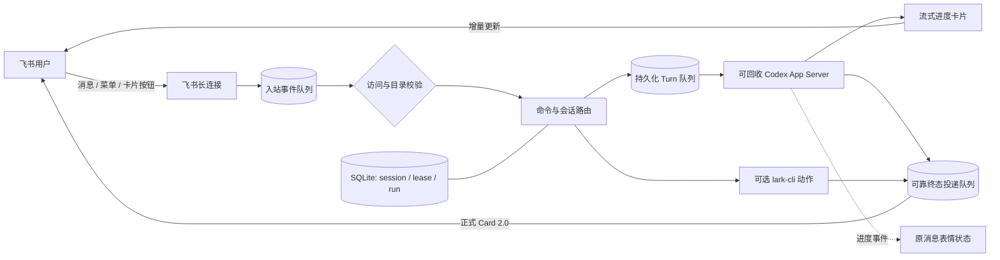

# Lark Codex Hub

[English](README.en.md) · [飞书配置](docs/FEISHU_SETUP.md) · [运维手册](docs/OPERATIONS.md) · [架构说明](ARCHITECTURE.md)


[](LICENSE)

把你自己的飞书机器人变成一条通往本机 Codex App Server 的安全、可靠、可恢复的远程通道。

你可以离开电脑后继续在飞书中交代编码任务、续接 Codex 会话、切换工作目录、接收完成通知，并通过受控的 `lark-cli` 扩展操作飞书。所有代码和凭据都留在自己的 Windows 电脑上，不需要公网服务器或第三方中转服务。

> [!IMPORTANT]
> 这是面向个人 Windows 工作站的自托管工具，不是多人共享的云端 Codex 服务。机器人会在你的电脑上运行 Codex 并修改允许目录内的文件，请先阅读[安全边界](#安全边界)。

## 为什么用它

- **离开电脑也能继续工作**：在手机飞书中发送需求，Codex 在本机执行并以卡片回复。
- **对话不会因重启丢失**：飞书会话与 Codex session 持久绑定，可查看历史或继续执行。
- **结果不会悄悄消失**：入站事件和回复先写入 SQLite，发送失败会自动重试。
- **进度一眼可见**：原消息依次显示思考、执行、输入、完成或失败表情。
- **回复实时更新**：Codex 输出会持续写入同一张进度卡片，结束后原卡片切换为正式结果。
- **连续消息不用重发**：执行中的新消息持久排队，短时间连续输入会自动合并，也可以用 `/steer` 追加到当前任务。
- **默认收紧权限**：仅允许指定用户和会话，并拒绝系统目录、状态目录等危险工作区。
- **开机静默运行**：通过 Windows 任务计划程序启动，不弹出容易误关的 CMD 窗口。
- **一个控制中心完成操作**：命令菜单会根据空闲、排队或执行状态动态显示会话、项目、队列和停止按钮。

## 功能一览

| 能力 | 基础安装 | 说明 |
| --- | :---: | --- |
| 飞书远程调用 Codex App Server | ✅ | 全局会话发现、新建、续接、恢复、转向和取消会话 |
| Codex CLI 全局会话接续 | ✅ | Desktop、VS Code、CLI 与飞书共享持久化会话；占用时安全交接 |
| 流式 Card 2.0 回复 | ✅ | 单卡增量更新、Markdown、长内容分片、状态和 Token 信息 |
| 进度与终态表情 | 可选 | 需要消息表情权限 |
| 持久化与断电恢复 | ✅ | SQLite WAL、入站队列、Turn 队列、投递队列和幂等键 |
| Session 并发保护 | ✅ | 防止不同飞书入口同时写入同一 Codex session |
| 主动通知 | ✅ | 本地脚本可主动把任务结果发送给你 |
| 飞书快捷菜单 | 可选 | 动态控制中心、状态、历史会话、目录、新建和取消 |
| 创建飞书任务/文档、代发消息 | 可选 | 需要安装并授权 `lark-cli`，高风险操作需卡片确认 |

## 工作方式



一条正常回复大致会呈现为：

> **Codex 回复**　`已完成`<br>
> 耗时：22 秒　·　工作目录：`D:\project`<br>
> Codex 会话：`01ab…`　·　Token：8000 输入 / 120 输出
>
> 已完成修改，并通过类型检查。

## 环境要求

- Windows 10/11。
- Node.js 22.12 或更高版本。
- 已安装并登录 [Codex CLI](https://learn.chatgpt.com/docs/codex/cli)。
- 一个开启机器人能力的飞书自建应用。
- Git，用于下载和更新项目。
- 可选：`lark-cli`，仅在需要创建飞书任务、文档或代发消息时安装。

当前版本没有验证 Linux、macOS、Docker 或服务器多用户部署。

## 快速开始

### 1. 配置飞书应用

在[飞书开放平台](https://open.feishu.cn/app)创建企业自建应用并开启机器人能力，然后完成以下配置：

1. 开通接收消息、机器人发送消息所需权限。
2. 使用长连接订阅 `im.message.receive_v1`。
3. 如需快捷菜单，订阅 `application.bot.menu_v6`。
4. 如需卡片按钮，订阅 `card.action.trigger`。
5. 创建并发布应用版本。

完整的权限、事件和菜单键配置见[飞书配置指南](docs/FEISHU_SETUP.md)。

### 2. 安装项目

```powershell
git clone https://github.com/AIME-JF/lark-codex-hub.git
Set-Location .\lark-codex-hub
npm ci
npm run check
```

### 3. 写入本机配置

准备以下信息：

- 飞书应用的 App ID 和 App Secret。
- 允许使用机器人的用户 `open_id`，格式通常为 `ou_xxx`。

凭据只通过临时环境变量进入安装程序，随后使用 Windows 当前用户的 DPAPI 加密保存：

```powershell
$env:LARK_APP_ID = "cli_xxx"
$env:LARK_APP_SECRET = "你的 App Secret"

node .\dist\cli\index.js setup --from-env `
  --owner "ou_xxx"

Remove-Item Env:LARK_APP_ID, Env:LARK_APP_SECRET
```

如果不使用 `lark-cli` 扩展，请打开 `%USERPROFILE%\.lark-codex-hub\config.v5.json`，将其关闭：

```json
{
  "larkCli": {
    "enabled": false,
    "command": "lark-cli"
  }
}
```

默认执行后端是可回收的 App Server。飞书 Turn 结束并进入空闲后，Hub 会回收子进程以立即释放跨客户端 writer；只有在排查兼容问题时才建议临时回退为逐消息 Exec：

```json
{
  "codex": {
    "backend": "exec"
  }
}
```

个人工作站默认只同时执行一个 Codex Turn，避免多个项目同时占满本机资源。需要时可以在运行配置中调整，最大值为 8：

```json
{
  "runtime": {
    "maxConcurrentTurns": 1
  }
}
```

### 4. 诊断并静默启动

```powershell
node .\dist\cli\index.js doctor
node .\dist\cli\index.js service install
node .\dist\cli\index.js service start
node .\dist\cli\index.js service status
```

看到计划任务状态为 `Running` 后，在飞书中发送：

```text
/status
```

如果机器人返回运行状态卡片，安装完成。

## 命令速查

| 命令 | 用途 |
| --- | --- |
| `/help`、`/hub` | 打开动态 Codex 控制中心 |
| `/new` | 明确选择在当前项目创建新 Codex 会话 |
| `/status` | 查看工作目录、session 和运行状态 |
| `/projects [页码或关键词]` | 浏览按工作目录归组的 Codex CLI 项目 |
| `/sessions [页码]` | 分页查看当前项目内的全局 Codex 会话 |
| `/history [页码]` | 分页查看当前 Codex 会话的用户与助手消息 |
| `/resume <session_id>` | 绑定一个白名单内的全局会话；绑定本身不会占用 writer |
| `/cancel` | 取消当前运行任务 |
| `/queue` | 查看当前范围等待执行的消息 |
| `/steer <补充指令>` | 把补充指令追加到当前运行中的 Turn |
| `/workspace` | `/projects` 的别名，打开项目中心 |
| `/tools` | 查看飞书扩展工具和参数 |
| `/send <bot\|user> <open_id\|chat_id> <ID> <内容>` | 通过 `lark-cli` 发送飞书消息 |
| `/task <标题>` | 通过用户身份创建飞书任务 |
| `/doc <标题>` | 使用后续 Markdown 正文创建飞书文档 |
| `/confirm <编号>`、`/reject <编号>` | 处理高风险飞书操作 |

除命令外的普通文本会发送给当前 Codex 会话；未知的 `/xxx` 命令会直接提示，不会消耗一次 Codex Turn。

## 主动通知

其他本地脚本可以把完成结果写入可靠投递队列：

```powershell
node .\dist\cli\index.js notify "构建已经完成"
```

服务在线后会将通知以卡片发送给 `ownerOpenId`；临时失败会自动退避重试。

## 数据与配置

默认状态目录是 `%USERPROFILE%\.lark-codex-hub`：

| 文件 | 内容 |
| --- | --- |
| `config.v5.json` | 非敏感运行配置、用户和项目发现策略 |
| `secrets.v2.json` | 当前 Windows 用户 DPAPI 加密的 App 凭据 |
| `hub.sqlite*` | session、队列、租约、运行和确认状态 |
| `logs\hub.log*` | 自动轮转并脱敏的结构化日志 |
| `service-launcher.v2.*` | 隐藏窗口启动器 |

升级、备份、卸载和恢复步骤见[运维手册](docs/OPERATIONS.md)。

## 安全边界

- 默认只有 `ownerOpenId` 可以使用机器人。
- 群聊默认必须提及机器人。
- 工作目录会解析符号链接和 Windows Junction，并拒绝用户主目录、系统目录和 Codex 状态目录等危险根目录。
- Codex 只开放 `read-only` 或 `workspace-write`，项目不提供 `danger-full-access` 配置。
- 子进程通过参数数组启动，不经过 shell。
- 飞书扩展只接受固定动作 Schema，不提供原始 `lark-cli` 命令透传。
- 高风险操作绑定发起人、聊天和会话，并通过原子状态切换防止重复确认。
- App Secret 不写入仓库或普通配置文件。

更完整的威胁模型和漏洞报告方式见[安全政策](SECURITY.md)。

## 已知限制

- Codex App Server 命令和协议仍可能随 Codex CLI 版本演进；升级 Codex CLI 后应先运行 `doctor` 再重启服务。
- Desktop、VS Code、CLI 和飞书共享的是 Codex 持久化历史，不是界面的实时消息镜像；本地列表偶尔需要刷新。
- 同一个 thread 同一时间只能由一个 App Server writer 持有。Desktop、VS Code 或其他 CLI 已加载会话时，飞书会提示占用，绝不会自动创建替代会话。
- Hub 的飞书 Turn 结束后会回收自己的 App Server，尽快释放 writer 给其他 Codex 客户端。
- 服务停止期间收到的飞书事件取决于飞书事件投递策略，项目只能恢复已经落入本地 SQLite 的事件。
- 被强制终止的 Codex 任务不会自动重跑，因为它可能已经修改过文件；重启后机器人会提示人工检查。
- 当前只支持文本提示，不支持从飞书消息直接传递图片或附件给 Codex。

## 排查问题

先运行：

```powershell
node .\dist\cli\index.js doctor
node .\dist\cli\index.js service status
Get-Content "$env:USERPROFILE\.lark-codex-hub\logs\hub.log" -Tail 50
```

| 现象 | 优先检查 |
| --- | --- |
| 完全没有回复 | 计划任务是否 `Running`、应用版本是否发布、长连接事件是否订阅 |
| 菜单没有反应 | 菜单事件键是否使用 `hub_*`，是否订阅 `application.bot.menu_v6` |
| 卡片按钮无效 | 是否订阅 `card.action.trigger`，修改后是否重新发布版本 |
| 没有进度表情 | 是否开通 `im:message.reactions:write_only` 并发布权限变更 |
| 一直提示会话忙 | `/status` 的 App Server 是否已连接、Codex Desktop 是否正在写同一 session；本地过期租约会自动释放 |

更多说明见[运维手册的故障排查章节](docs/OPERATIONS.md#故障排查)。

## 文档

- [飞书开放平台配置](docs/FEISHU_SETUP.md)
- [安装、升级、备份与故障处理](docs/OPERATIONS.md)
- [架构与可靠性设计](ARCHITECTURE.md)
- [消息、会话与动作协议](docs/PROTOCOL.md)
- [安全政策](SECURITY.md)
- [贡献指南](CONTRIBUTING.md)
- [更新记录](CHANGELOG.md)

## 开发与贡献

```powershell
npm ci
npm run check:release
```

提交问题或 PR 前请阅读[贡献指南](CONTRIBUTING.md)。请勿在 Issue、日志或截图中公开 App Secret、Token、真实消息内容或本机路径。

## License

[MIT](LICENSE)
